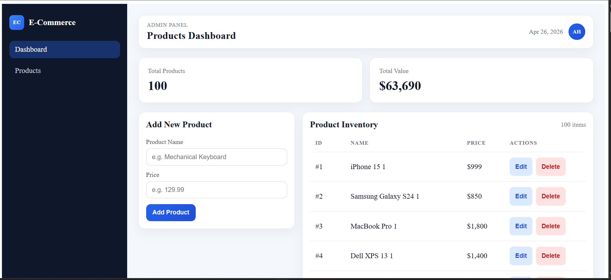
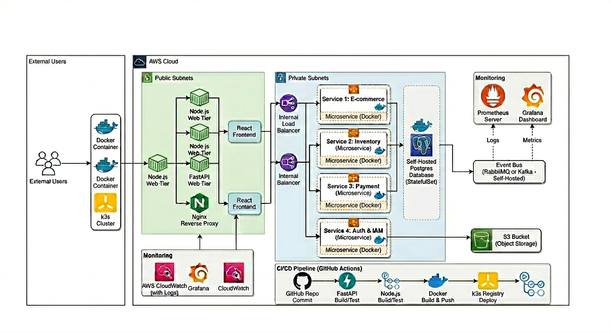
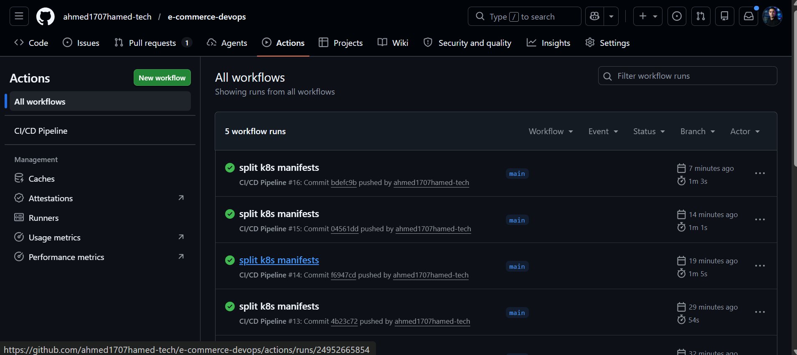
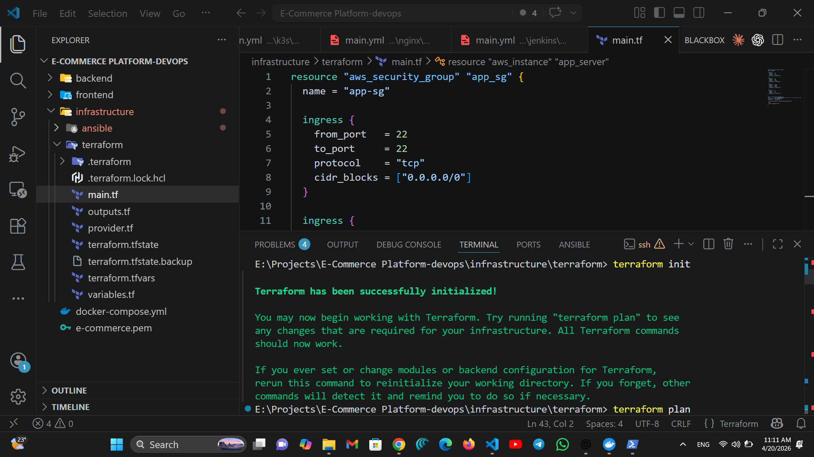
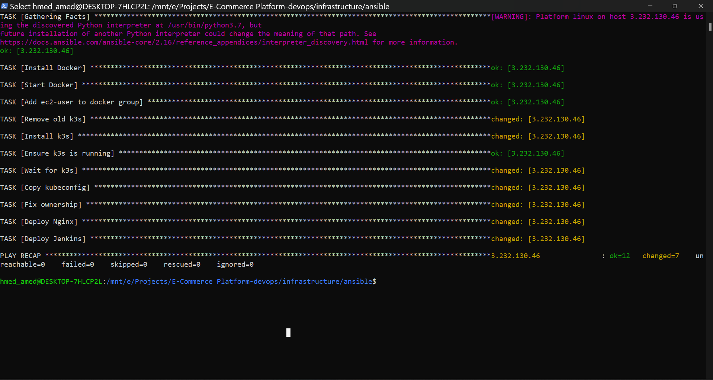
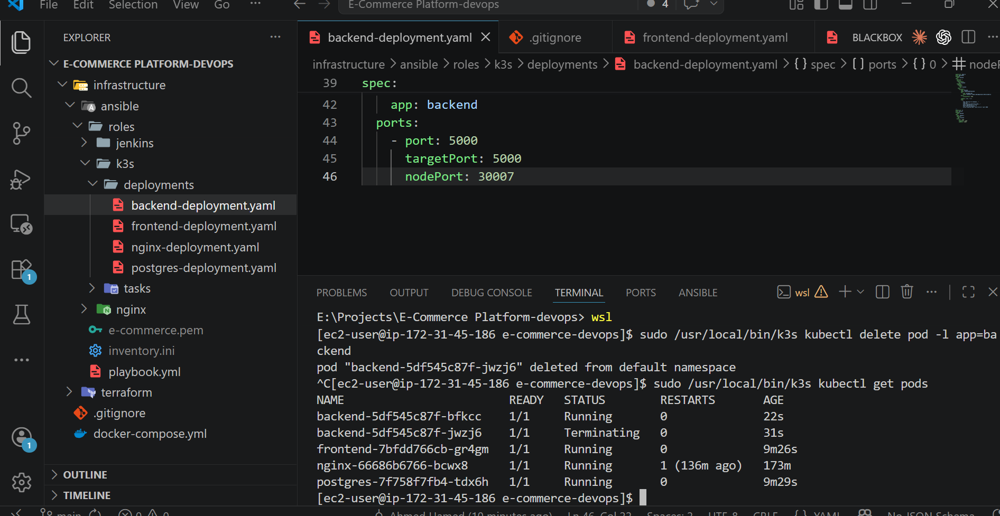
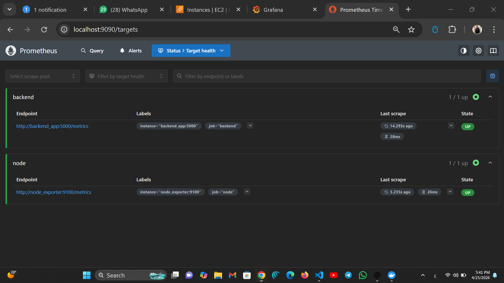
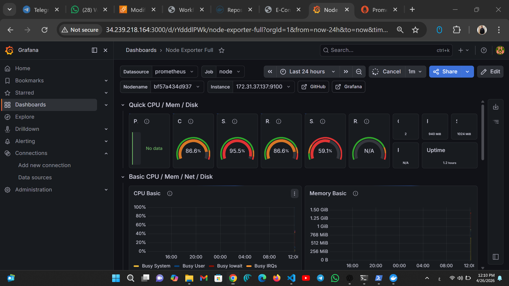
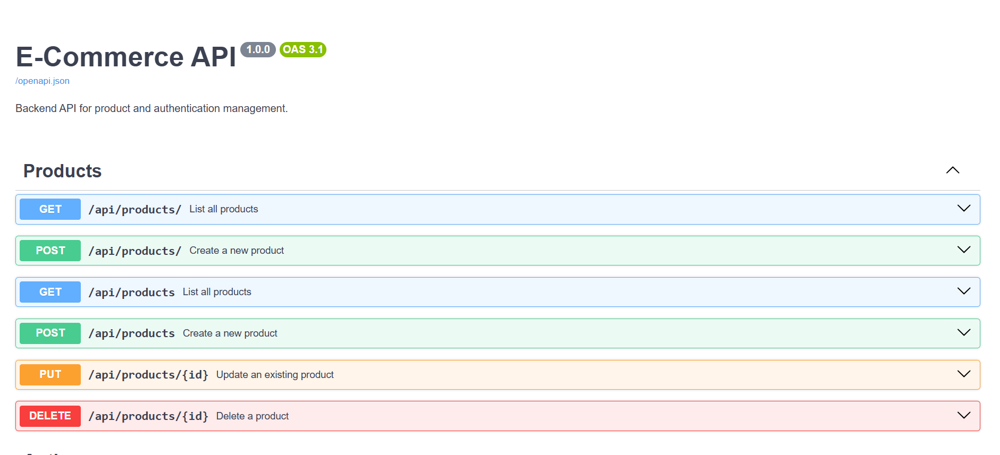

# 🚀 E-Commerce Platform - DevOps Project

A full-stack **E-Commerce application** deployed using modern **DevOps practices** including Kubernetes, CI/CD, Monitoring, and Infrastructure as Code.

---

## 📸 Project Preview

---

## 🏗️ Architecture

---

## ⚙️ Tech Stack

### 🖥️ Application

* Frontend: React + Nginx
* Backend: FastAPI (Python)
* Database: PostgreSQL

### 🚀 DevOps & Infrastructure

* Docker
* Kubernetes (k3s)
* AWS EC2
* Terraform (Infrastructure as Code)
* Ansible (Provisioning)

### 🔄 CI/CD

* GitHub Actions
* Docker Hub

### 📊 Monitoring

* Prometheus
* Grafana

---

## 📂 Project Structure

E-Commerce Platform-devops/

├── backend/
├── frontend/
├── infrastructure/
│   ├── terraform/
│   ├── ansible/
│   └── k8s/
│
├── monitoring/
├── docker-compose.yml
└── README.md

---

## ⚡ Features

* 🛒 Product management (Add / Edit / Delete)
* 📊 Monitoring system (CPU / Memory / Metrics)
* 🔁 CI/CD pipeline automation
* ☁️ Cloud deployment on AWS
* 📦 Containerized microservices
* 📈 Scalable with Kubernetes

---

## 🔄 CI/CD Pipeline

**Flow:**

1. Push code to GitHub
2. GitHub Actions runs pipeline
3. Build Docker images
4. Push to Docker Hub
5. Deploy to Kubernetes

---

## ☁️ Infrastructure (AWS + Terraform)

* EC2 Instance provisioning
* Security Groups configuration
* Automated setup using Terraform

---

## ⚙️ Configuration (Ansible)

* Install Docker
* Install k3s (Kubernetes)
* Setup environment automatically

---

## ☸️ Kubernetes Deployment

* Backend service
* Frontend service
* PostgreSQL database
* Nginx Ingress

---

## 📊 Monitoring

### 🔹 Prometheus Targets

### 🔹 Grafana Dashboard

---

## 📚 API Documentation

Swagger UI available at:
http://<YOUR-IP>/docs

---

## 🌐 Deployment URLs (Example)

Frontend:
http://<EC2-PUBLIC-IP>

API:
http://<EC2-PUBLIC-IP>/api/products

Grafana:
http://<EC2-PUBLIC-IP>:3000

Prometheus:
http://<EC2-PUBLIC-IP>:9090

---

## ▶️ Run Locally

docker-compose up -d

---

## 🧠 Key Learnings

* Kubernetes deployment & debugging
* Handling image pull errors & scaling issues
* Monitoring with Prometheus & Grafana
* CI/CD automation with GitHub Actions
* Infrastructure automation with Terraform & Ansible

---

## 👨‍💻 Author

Ahmed Hamed
https://github.com/ahmed1707hamed-tech

---

## ⭐ Give it a Star

If you like this project, don't forget to ⭐ the repo!
